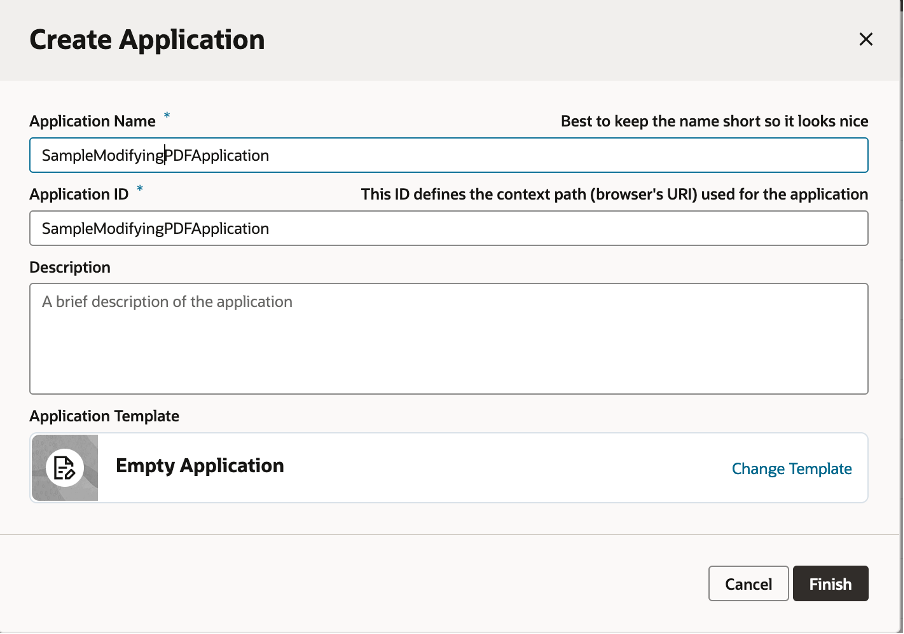
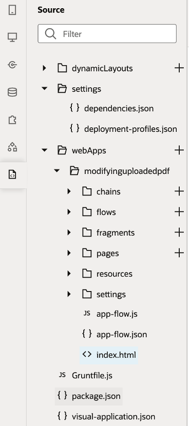
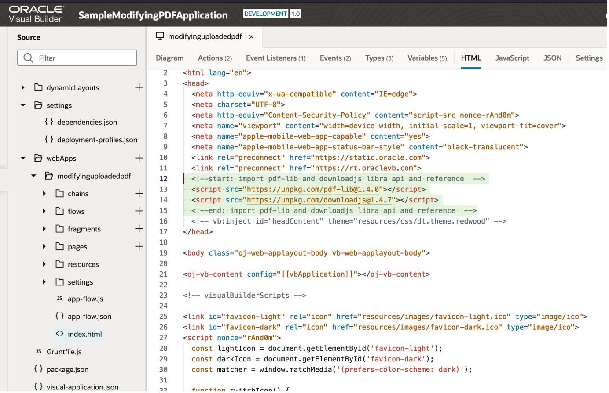

## Develop a Web Application that modifies PDF documents ##

App users are consuming, are modifying, are generating PDF documents in many contexts and for various purposes. Very often, an uploaded PDF document needs to be read by an application and the content of this document altered accordingly. Add a new text, draw a rectangle around a part of document, split the pdf in different pages, insert an image are some of the most common actions that an application should be able to perform to a PDF document. In some cases a new PDF document needs to be created from scratch and populated with information that is generated by the application. 

Oracle Visual Builder provides tools and templates that enable you to build web applications that can leverage the usage of external JavaScript libraries to create, update and download PDF Documents. 

This architecture solution provides all the necessary guidance on how to implement this functionality into you Visual Builder applications (web and mobile). 

We are describing the development of an one-page web application that will enable a user to upload or create a new PDF file, modify this document with a custom text and display the document on the main page of the application and if needed it download the file on a local client repository. 

Also the repository contains the source code for an Oracle Visual Builder web application that can be used as an example of such an implementation.

## Before You Begin ##

Developers create applications (web or mobile) with Oracle’s Low Code Visual Builder that need to handle files in PDF format. Different use cases may require: 

- A pdf document creation, 
- A modification of a pdf content (add or remove pages, text, images)
- Merge different PDF document into one or split a multipage pdf document.

The produced and generated pdf document it can be either:

- displayed on the application UI
- downloaded by the user of the application
- stored on a bucket 
- sent to other OCI services for further processing (e.g. OCI Document Understanding service)

When Oracle Visual Builder is the development platform for this kind of operations an external library is required to be imported, to produce and to update the PDF documentation. 

Therefore is important to have previously assess the available JavaScript libraries that their API can address your application requirements. For this solution architecture the PDF-LIB (<https://pdf-lib.js.org/>) API has been chosen to create a new PDF document and to modify an existing PDF Document. 

## Architecture ##
This architecture diagram shows a common way to develop and integrate a Web Application that is implemented and deployed with Oracle Visual Builder. 

Using Oracle Visual Builder Platform to develop and build the applications that in turn communicate with the back-end storage service. Oracle Visual Builder is where you create the pages that render the interface of your application, create the service connections that connect to REST services, and define build configurations so that the build services included in Oracle Visual Builder can create Android, iOS, Progressive Web Apps, or web apps.

## About Building Applications with Oracle Visual Builder

Follow these steps when you develop your application(s) using Oracle Visual Builder.

1. Create an instance of Visual Builder service (if there is not already one created) from the stand-alone Visual Builder service or new integration instance (if there is not already one created) from the OIC service
1. Create a new Visual Builder Application
1. Create a new web application in Oracle Visual Builder.
1. Create the pages and the overall User Interface that exposes controls, such as buttons to upload files, to create new pdf documents, to download the updated documents.
1. Create the variables and constants that will be used to host the extracted or included information from and to the PDF document. 
1. Import the necessary external resources / libraries
1. Develop the required JavaScript code to:
   1. Upload a file from the local system, 
   1. Modify the uploaded pdf file with the entered text
   1. Create a new PDF document 
   1. Download the PDF file
1. Test the application with the appropriate user and document
1. Stage and publish the web application.

## Required Services and Roles
This solution requires the Oracle Visual Builder service.

|Service Name: Role|Required to...|
| :-: | :-: |
|Oracle Cloud: Administrator|Manage mobile users, roles, and realms|
|Oracle Visual Builder: The Visual Builder Developer predefined role that maps to the ServiceDeveloper application-layer predefined role.|To create, manage, secure, and publish web and mobile applications.|

## Create a Visual Builder Application

A Visual Builder application is a collection of resources that you use to develop web and mobile applications. A Visual Builder application includes metadata in JSON files that describe data sources, business objects and includes HTML and JavaScript files of the web and mobile applications.

Create a new Visual Builder application:

On the Visual Applications home page, click New. In the Create Application dialog box, type the application name as the application ID field is automatically populated based on the application name that you provide. You can modify the Application ID if you wish, but the Application ID must be unique in your identity domain. Leave the default selection of Empty Application unchanged. The Empty Application template does not create any artifacts, apps or other resources. At the end click on Finish.

*Create a Web Application*

A new Visual Builder application opens automatically when you create it and displays the Welcome screen. The new Visual Builder application does not contain any artifacts, but the wizard creates the file structure of the application and some resources and files for you by default. You can use the Welcome screen to help you decide which artifacts you want to create first. Click any of the tiles in the Welcome screen to open the panel in the Navigator where you can create and manage the artifacts. You can add multiple web and mobile applications and all the applications can access the data sources, resources, services that you expose in your visual builder application.

## Create a New Web Application
Each web application in your visual builder application is independent, but they can all use the data sources defined in the visual builder application. To create a new web application in a visual builder application you can:

1. Click Web Applications icon in the Navigator to open the Web Apps pane. Structural representations of each of the web applications in your visual builder application are displayed in the Web Apps pane.

*Web Apps in Visual Builder*

If no web applications have been created, you will see a message in the pane and a “+ Web Application” button that you can click to open the Create Web Application wizard. 

2. Click Create Web Application (Create Web Application icon) in the Navigator. 

*Web Application Wizard*

In the General Information page of the Create Web Application wizard, specify the application name for the web application you are about to create. You can also choose from three navigation styles. The Horizontal navigation style with three navigation items. A Vertical navigation style is also available that allows you to create a root page with a navigation drawer panel including a header with an avatar, navigation items in the middle, and a footer with the application name. A page flow, with a starter page, is generated for each navigation item. The default selection is None. 

Click the “Create” button to create and generate the web application along with all the necessary artifacts. 

## Include the external library
The artifact that has been created for this application are accessible through the source icon. 

*Source code artifacts of a web application through Oracle Visual Builder* 

In order to include two external libraries: 

1. pdf-li to manage the PDF Document 
2. downloadj to download the PDF document that has been generated

you can insert inτο the index.html file the sources for both libraries: 

      

      

See example below: 

*Index.html file modifications*

## Create a User Interface
Create a user interface that will allow to: 

- upload a file, 
- write a text into a field that will be displayed in the pdf document, 
- a button to update the uploaded pdf document with the entered text 
- a button to create a new pdf document with the entered text
- a button to download the prepared document 

The user interface will be comprised from components like containers, headers, buttons , text fields, JavaScript code, html code. 
### Drag and Drop file and display PDF document
1. From the components palette we construct into the page designer by drag and dropping a “Flex Row” and into this component a “Heading” (with the text: Upload PDF Document) and finally the “File Picker” component.

*File Picker button to upload a pdf document*

2. Create a variable of type String with the name “fileURL” which will be used to store on page level the url of the pdf document, that will later be used for display in the page.

*Variable fileURL*

3. Create a variable of type any with the name “holdFile” which will be used to store on page level the content of the pdf document

*Variable holdFile*

4. On the “File Picker” properties palette create a new event “on Select Files” that will create a new Action Chain with the name “FilePickerSelectChain”. 

*New event “on Select Files”*

5. Define and implement the Action Chain “FilePickerSelectChain” along with a javascript that will read the content of the upload blob object. This javascript function will be implemented on a page level and will store two variables: one the convert the pdf file into a base64 string and the second one with the document URL that will be displayed on the page. The action chain will be comprised by 3 steps: 
   1. Initialize and reset the fileURL variable
   2. Call a Function addPDFDocument with input parameter the file that has been uploaded
   3. Assign the outcome of the addPDFDocument function into the fileURL and the holdFile variables

*Action Chain: FilePickerSelectChain*
#### *Create addPDFDocument function*
Create a function “addPDFDocument” on a page level. The application will receive one input parameter. The function will instantiate a url variable based on the input file parameter and then will read the uploaded document and converted into a base64 string. A sample code below can be used to define the function. 

      PageModule.prototype.addPDFDocument = function(arg1) {

         return new Promise(   
            resolve=>{
   
            const blobURL = URL.createObjectURL(arg1);
      
            const reader  = new FileReader();
      
            reader.addEventListener("load", function () {
      
            // convert image file to base64 string         
         
            resolve({ data: reader.result, url: blobURL });
         
         }, false);
      
         if (arg1) { reader.readAsDataURL(arg1); }
      
      });      
   
      };

#### *Assign the input variable of the “addPDFDocument” function*
Using the graphical interface assign the uploaded file variable into the “arg1” parameter of the function. 

*Assign uploaded file into the input variable of the function.*
#### *Assign the output of the “addPDFDocument” function to the page variables fileURL and holdFile*
Assign the returned addPDFDocument function properties url and data into the page variables fileURL and holdFile respectively. 

   

*Assign variable fileURL		Assign variable holdFile*
#### *Display the uploaded pdf File to the main page screen*
On the source html code of the main page, add an object with source the previously assigned page variable fileURL, as shown in the below example: 

*Add fileURL object in the main html page.*

At this stage the application can upload and display a pdf file as shown on the following application preview: 

*Application Preview*
### Update uploaded PDF document
From the components palette we include into the page designer by drag and dropping a “Text Field” component and below this a new button component, as shown in the example below: 

*Update PDF button and text field*

Create a page variable “textIncludedIntoPDF” that will store the content of the text field to insert it and update the pdf document with this field. 

*Variable textIncludedIntoPDF*

Assign the new created variable to the Input Text component: 

*Assign page variable textIncludedIntoPDF to the InputText component.* 
#### *Update and display PDF*
Create a new event on action for the button with the label “Update PDF”. The event will create a new Action Chain with the label “update\_display\_pdf”

*New action chain “update\_display\_pdf”*

The new action chain will use a JavaScript function to update the uploaded PDF and then through a temporary page variable a second JavaScript function with regenerate and display the new created PDF document. 

*update\_display\_pdf* 
#### *Create the updatePDF function*
The JavaScript function: “createUpdatePDF” is an asynchronous function with two input parameters (the uploaded pdf document and the text that the user has previously entered on the main page) and returns a byte array. 

The execution flow of the function follows 

1. Declaration of constants from the pdf-lib API 
2. Creation of a PDFDocument entity and loads the input pdf byte array
3. Get an array of all the pages contained in this document. 
4. Identify the first page rendered at the index = 0 of the document
5. Calculate the page’s width and height
6. Write the text that you had entered (in red color and with and angle of 45 degrees) 
7. Save, serialize, and return the PDFDocument to bytes (a Uint8Array)

The following code sample can be used to simulate the above functionality:

      PageModule.prototype.createUpdatePDF = async function (arg1 , inputText ) {
          // declare constants from the pdf-lib API.
          const { degrees, PDFDocument, rgb, StandardFonts , grayscale} = PDFLib;
          console.log("createUpdatePDF: input file " + arg1);
          console.log("createUpdatePDF: input argument " + inputText);
          const existingPdfBytes = arg1;
          // create a PDFDocument entity and load the input pdf byte array 
          const pdfDoc = await PDFDocument.load(existingPdfBytes);
          // get an array of all the pages contained in this document. The pages are stored in the array in the same order that they are rendered in the document with the first page page in the 0 position. 
          const pages = pdfDoc.getPages();
          // get the first page rendered at the index = 0 of the document
          const firstPage = pages[0];
          // get the first page width and height
          const { width, height } = firstPage.getSize();
          console.log("createUpdatePDF: The width : " + width + "and height : " + height +" of the first page");
          // Embed a Helvetica font into the pdf document
          const helveticaFont = await pdfDoc.embedFont(StandardFonts.Helvetica);
          // write the text that you had entered and draw a rectangle 
          firstPage.drawText(inputText, {
               x: 5,
               y: height / 2 + 300,
               size: 50,
               font: helveticaFont,
               color: rgb(0.95, 0.1, 0.1),
               rotate: degrees(-45),
               });
          // createUpdatePDF: save and serialize the PDFDocument to bytes (a Uint8Array)
         const pdfBytes = await pdfDoc.save();
         return pdfBytes;
         };

#### *Display the updated PDF document*
The outcome of this function will be assigned to the temporary page variable tmpPDFBytes

Following this assignment, a JavaScript function will receive the base64 byte array and it will instantiate a new blob entity from this byte array. Finally, the function will create and return a URL that correspond to this PDF document. The following code sample can be used to simulate the above functionality:

      PageModule.prototype.displayPDFDocument = function (arg1) {
         const bytes  = new Uint8Array( arg1 );
         // create a new blobfrom the byte array with type of application: pdf 
         const blob   = new Blob( [ bytes ], { type: "application/pdf" } );
         // create the url of the generated blob entity
         const newdocURL = URL.createObjectURL(blob);
         // return the updated pdf's url
         return newdocURL;
        };

The outcome of this functions will be assigned to the page variable “fileURL” that will be used to display the updated pdf document in the page. 

*Assign value to fileURL*

At this point the application has ready and implemented to the functionality of uploading a PDF document, modifying it with a text that the user has entered in the text field of the screen and finally the updated PDF document is displayed on the screen. The following print screen depict the functionality with an Oracle Cloud Infrastructure document.

*The outcome of the “Update PDF” button at this stage of the application*
### Create a new PDF document
From the components palette we include into the page designer by drag and dropping a “Button” component, as shown in the example below: 

*Create new PDF button*
#### *Create and display document*
Create a new event on action for the button with the label “Create new PDF”. The event will create a new Action Chain with the label “create\_display\_pdf”

*Create and display pdf event*

The new action chain will use a JavaScript function to create a new PDF (with the previous entered text in the text field) and then through a temporary page variable a second JavaScript function with regenerate and display the new created PDF document. 

*Create\_Update\_pdf action chain*

#### *Create PDF function*
The JavaScript function: “createPDF” is an asynchronous function with one input parameter (text that the user has previously entered on the main page) and returns a byte array. 

The execution flow of the function follows 

1. Declaration of constants from the pdf-lib API 
2. Creation of a PDFDocument entity 
3. Embed the Times Roman font
4. Add a blank page to the PDF document object
5. Calculate the page’s width and height
6. Write the text that you had entered 
7. Save, serialize, and return the PDFDocument to bytes (a Uint8Array)

The following code sample can be used to simulate the above functionality:

      PageModule.prototype.createPDF = async function (arg1) {
         const { degrees, PDFDocument, rgb, StandardFonts , grayscale} = PDFLib;
         console.log("createPDF: input file " + arg1);
         // create a PDFDocument entity and load the input pdf byte array 
         const pdfDoc2 = await PDFDocument.create();
         // Embed the Times Roman font
         const timesRomanFont = await pdfDoc2.embedFont(StandardFonts.TimesRoman);
         // Add a blank page to the document
         const page2 = pdfDoc2.addPage();
         // Get the width and height of the page
         const { width2, height2 } = page2.getSize();
         // Draw a string of text toward the top of the page
      const fontSize2 = 30;
      page2.drawText(arg1, {
         x: 50,
         y: 450,
         size: fontSize2,
         font: timesRomanFont,
         color: rgb(0, 0.53, 0.71),
       });

      // createUpdatePDF: save and serialize the PDFDocument to bytes (a Uint8Array)

      const pdfBytes2 = await pdfDoc2.save();
      return pdfBytes2;
      };    
   
#### *Display the newly created PDF document*
The outcome of this function will be assigned to the temporary page variable tmpPDFBytes

Following this assignment, a JavaScript function will receive the base64 byte array and it will instantiate a new blob entity from this byte array. Finally, the function will create and return a URL that correspond to this PDF document. The same function that has been implemented for the “update\_display\_pdf” action chain will be reused. The outcome of this functions will be assigned to the page variable “fileURL” that will be used to display the created pdf document in the page. 

At this point the application has ready and implemented to the functionality of crerating a PDF document, modifying it with a text that the user has entered in the text field of the screen and finally the newly created PDF document is displayed on the screen. The following print screen depict the functionality with an Oracle Cloud Infrastructure document.

*The outcome of the “Create new PDF” button at this stage of the application*
### Download PDF file
From the components palette we include into the page designer by drag and dropping a “Button” component, as shown in the example below: 

*Download PDF  button*
#### *Download document*
Create a new event on action for the button with the label “Download PDF”. The event will create a new Action Chain with the label “downloadPDF”

*Download pdf event*

The new action chain will use a JavaScript function to download a PDF file (with the previous entered text in the text field). 

*DownloadPDF action chain*
#### *Download PDF File*
The JavaScript function: “downloadPDFfile” is an function with one input parameter (the byte array of the pdf document that has been either uploaded and modified or created from scratch) and downloads the document with a predefined name : “pdf-lib\_modification\_example.pdf” and of type “application/pdf”. 

The function is using the download() function (from the library downloadj that we hid initially imported into our application). The input arguments of the download() function can be a URL, String, Blob, or Typed Array of data, or via a dataURL representing the file's data as base64 or url-encoded string, the name of the new file placed in the browser's download directory and the type of file. 

The following code sample can be used to simulate the above functionality:

      PageModule.prototype.downloadPDFFile = function (arg1) {
          download(arg1, "pdf-lib\_modification\_example.pdf", "application/pdf");
      };

# Deploy 
## Publish a web application from Oracle Visual Builder
Once you have developed the web application in Oracle Visual Builder with the functionality that you want it to present to end users, you can stage and publish the application so that you can test it and/or distribute it to end users.
## Staging and Publishing a Web Application
You can stage and publish visual applications from the Visual Builder Home page. To stage and publish an app, you deploy the app's resources to the Visual Builder runtime environment that provides services used by the staged and published apps. The Visual Builder runtime environment provides the server for delivering pages in web applications, and services your web and mobile apps might use to access data, including the database used to store data and the proxy server for managing connections to REST services. The runtime is used when you are designing apps in the Designer and for staged and published applications. The runtime also integrates Oracle Identity Cloud services (IDCS) to manage the authentication and authorization of app users. 

The following steps are performed for you when you stage an app:

1. The application's resources are copied to a directory on the server
2. The database schema in the staging database is updated with changes from the development database 
3. A URL is created for accessing the staged web app or downloading the mobile app. The web and mobile apps access the services and resources provided by the staged application.

The following steps are performed for you when you publish an app: 

1. The directory containing the staged application's resources becomes the live app. The staged app is not accessible after it is published.
2. The database schema in the live database is updated with changes from the staging database. You can choose if and how data should be migrated from the staging database to the live database.
3. A new URL is created for accessing the live web app or downloading the mobile app the first time you publish the app. For web apps, this is the permanent URL for accessing the app. Web and mobile apps access the services and resources provided by the published app.

You must stage an app before you can publish it. When an app is published, the staged app becomes the live version, and the app settings defined for the staged app are applied to the published app. A Visual Builder Web Application cannot be modified after it is published without creating a new version and staging and publishing it again.

The runtime environment also provides a proxy server that your apps can use to help with authorizing calls to services. You can bypass the proxy if you choose, for example, by using the Direct authentication mechanism in your app to call services.

### Stage a Visual Application
You can stage unpublished versions of your application at any time from the Home page or from the main menu. 

The entire process of staging a visual application is accessible through this [link](https://docs.oracle.com/en/cloud/paas/app-builder-cloud/visual-builder-developer/staging-and-publishing-visual-applications.html#GUID-55ADCBA3-45BB-465C-9610-055CD96B8661) to Oracle’s service documentation. 
### Publish a Visual Application
You can publish a stage version of your application at any time from the Home page or from the main menu. 

The entire process of publish a visual application is accessible through this [link](https://docs.oracle.com/en/cloud/paas/app-builder-cloud/visual-builder-developer/staging-and-publishing-visual-applications.html#GUID-FCDF7509-5E48-4AFF-9535-5E13F8B23720) to Oracle’s service documentation. 

